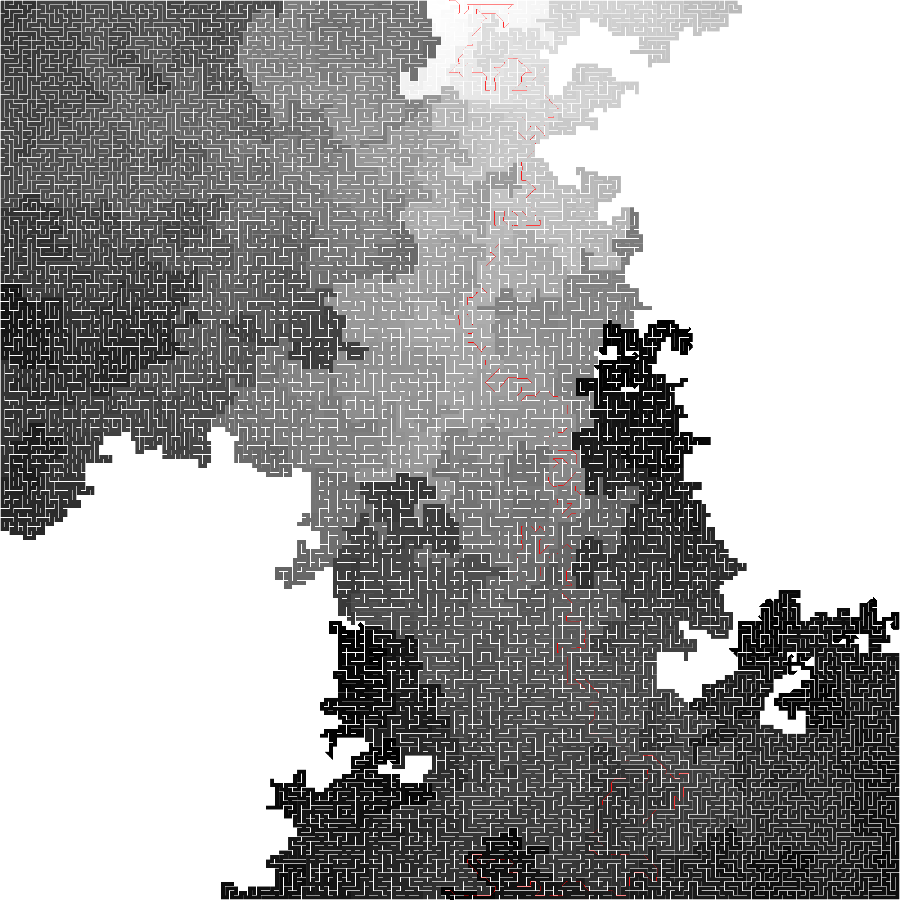

# maze-solver-cuda
C++ based maze solver using Lee Algorithm, accelerated with Nvidia CUDA
<br><br>

## Requirements
- Nvidia CUDA
: https://developer.nvidia.com/cuda-downloads
- openCV 4.1.2-vc14_cv15
: https://opencv.org/opencv-4-1-2/
- you need to copy 'opencv_world412d.dll' to your project directory.
<br><br>

## Input Maze image
You can get randomly generated input maze image from here :
www.mazegenerator.net  

input ex)


<br><br>

## Usage
### Windows
compile with Visual Studio (use .sln file)


### linux
compile cu file with below command
```
nvcc maze_solver_cuda_fast.cu
```
<br><br>

## Results
### 322x322 pixels


### 1602x1602 pixels


### 3202x3202 pixels
[Input Maze Image] 


[Output Solution]



